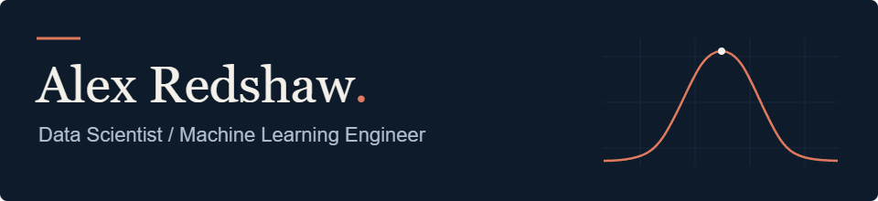

  

  <strong>Senior Associate at PwC</strong> · London 
  <a href="https://atredshaw.com/">Portfolio</a> · <a href="https://www.linkedin.com/in/alex-redshaw-a21711323/">LinkedIn</a> · <a href="https://atredshaw.com/projects.html">All projects</a>

  
  
  
  
  

I work on Python and SQL pipelines, forecasting models and Azure-based AI projects. Outside work, I build tools around football, FPL and theme parks.

Football analytics got me into data and became the subject of my dissertation at Leeds. I like working from the data and model through to the app and deployment. FPL is responsible for a fairly unreasonable amount of my Python.

## Selected projects

### xLthm

*FPL forecasts · statistical modelling · daily batch inference*

An FPL forecasting platform that estimates player points, minutes and event probabilities. It combines six statistical and ML components with joint Monte Carlo fixture simulations, covering team goals, playing time, attacking output, defensive actions, discipline and bonus points.

The modelling pipeline uses historical FPL data, pre-match features and chronological walk-forward validation. Daily batch jobs refresh the projections in SQLite, which are served through a Flask API and React dashboard. Deployed with Docker and GitHub Actions on Oracle Cloud Infrastructure.

  

[Live site](https://xlthm.atredshaw.com/) · [Write-up](https://atredshaw.com/projects.html?project=xlthm-fpl-points-projections)

<table>
  <tr>
    <td width="50%" valign="top">
      <h3>xG Plotter</h3>
      
scikit-learn · ONNX · JavaScript

      
An interactive football shot plotter with a custom expected goals model. I processed over 500,000 shots, trained logistic regression models and compared their probability estimates using Brier scores and calibration analysis.

      
The models run directly in the browser through ONNX Runtime Web. Users can explore shot probabilities, view heatmaps and save match plots without a running prediction server.

      
<a href="https://atredshaw.github.io/Redshaw-xG/">Live site</a> · <a href="https://atredshaw.com/projects.html?project=custom-football-xg-model-interactive-plotter">Write-up</a> · <a href="https://github.com/ATRedshaw/Redshaw-xG">Code</a>

    </td>
    <td width="50%" valign="top">
      <h3>PredictTheBall</h3>
      
Flask · React · Elo · Monte Carlo

      
A Premier League table prediction game with private leagues, live scoring and leaderboards. An Elo model simulates the remaining season 10,000 times to estimate finishing-position probabilities and give players a benchmark for their own predictions.

      
I built the React frontend, Flask backend, data pipeline and deployment on Oracle Cloud Infrastructure. It turned into quite a lot of code for an argument about football.

      
<a href="https://predict-the-ball.atredshaw.com/">Live site</a> · <a href="https://atredshaw.com/projects.html?project=predicttheball-premier-league-predictions">Write-up</a> · <a href="https://github.com/ATRedshaw/predict-the-ball">Code</a>

    </td>
  </tr>
  <tr>
    <td width="50%" valign="top">
      <h3>Theme Park Crowd Predictor</h3>
      
Playwright · scikit-learn · Streamlit

      
A Python pipeline that collects historical queue readings with Playwright, stores them in SQLite and predicts daily park crowd levels using a Bayesian-tuned Random Forest.

      
Calendar, holiday, weather and opening-hours features feed a Streamlit dashboard for comparing future dates. The park-level model is working. Predicting waits at individual rides is the next stage.

      
<a href="https://atredshaw.com/projects.html?project=theme-park-visitor-modelling">Write-up</a> · <a href="https://github.com/ATRedshaw/theme-park-queue-modelling">Code</a>

    </td>
    <td width="50%" valign="top">
      <h3>LLM-assisted AAC research</h3>
      
Multimodal LLMs · Groq · Python

      
An ongoing research prototype exploring whether image-conditioned word suggestions can make Augmentative and Alternative Communication faster and less physically demanding.

      
I built a browser experiment comparing static vocabulary grids with suggestions from a multimodal LLM, then analysed interaction logs, communication speed and AI latency in Python. Early findings favour the assisted interface, though the sample and study design still limit what can be concluded.

      
<a href="https://atredshaw.com/projects.html?project=multimodal-llm-research-for-aac">Write-up</a>

    </td>
  </tr>
  <tr>
    <td width="50%" valign="top">
      <h3>FPL Challenge Optimiser</h3>
      
Python · PuLP · Probabilistic modelling

      
An optimisation engine that adjusts player point projections for each week's scoring rules, then uses PuLP to select a squad under budget, position and club constraints.

      
A hindsight pass runs the same solver on actual points. The accompanying dashboard compares selections and outcomes across the season, making it easier to see where the forecasts and rule adjustments fell short.

      
<a href="https://atredshaw.github.io/fpl-challenge-optimisations/">Live site</a> · <a href="https://atredshaw.com/projects.html?project=fpl-challenge-optimisations">Write-up</a> · <a href="https://github.com/ATRedshaw/fpl-challenge-optimisations">Code</a>

    </td>
    <td width="50%" valign="top">
      <h3>WhirlWatch</h3>
      
Flask · React · Groq · TMDB

      
A shared film and TV watchlist app with group ratings and AI-assisted recommendations. LLM-generated titles are matched against TMDB before results are shown, giving recommendations real catalogue records and metadata.

      
Built with Flask, React and SQLAlchemy, with Groq for suggestions and RapidFuzz for title matching.

      
<a href="https://whirlwatch.onrender.com/">Live site</a> · <a href="https://atredshaw.com/projects.html?project=whirlwatch-media-tracking-ai-recommendations">Write-up</a> · <a href="https://github.com/ATRedshaw/whirl-watch">Code</a>

    </td>
  </tr>
</table>

## At work

I joined PwC as a technology degree apprentice in 2020 and became a Senior Associate in July 2025. My work includes Python and SQL reconciliation pipelines for datasets covering over 10 million daily banking transactions, scikit-learn forecasting for resource and commercial planning, and Azure-based RAG/LLM document extraction.

I also build Power BI and Tableau dashboards and explain model behaviour, assumptions and data limitations through client workshops and technical walkthroughs.

## Tools

| Area | Tools |
| --- | --- |
| Data and modelling | Python, SQL, pandas, NumPy, scikit-learn, SciPy, PuLP |
| AI | Azure AI, RAG, multimodal LLMs, Groq |
| Apps | Flask, React, TypeScript, Streamlit, ONNX Runtime Web |
| Delivery | Docker, GitHub Actions, SQLite, Azure, Oracle Cloud Infrastructure |
| Visualisation | Plotly, Matplotlib, Power BI, Tableau |

## Education and certifications

BSc Computer Science (Digital & Technology Solutions), University of Leeds, 2:1. Completed through PwC's degree apprenticeship, with first-class grades in my football modelling dissertation and Masters-level Data Science module.

- [Microsoft Certified Machine Learning Operations Engineer Associate (AI-300)](https://learn.microsoft.com/en-gb/users/alexredshawuk-7850/credentials/2437fc2a429aebd9?ref=https%3A%2F%2Fwww.linkedin.com%2F), August 2026
- [Azure AI Engineer Associate (AI-102)](https://learn.microsoft.com/api/credentials/share/en-gb/AlexRedshawUK-7850/A925928DDD97389E?sharingId=C183137B04FE9A8C), June 2026
- [Azure Data Scientist Associate (DP-100)](https://learn.microsoft.com/api/credentials/share/en-us/AlexRedshawUK-7850/3D296666B7DA157C?sharingId=C183137B04FE9A8C), June 2025
- [Azure AI Fundamentals (AI-900)](https://learn.microsoft.com/api/credentials/share/en-gb/AlexRedshawUK-7850/67A0F1144119022E?sharingId=C183137B04FE9A8C), March 2025

